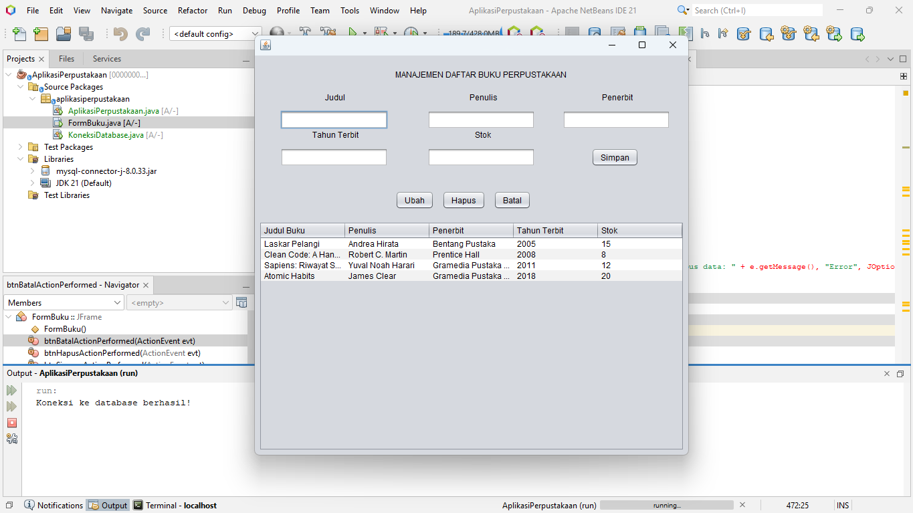

# Aplikasi Manajemen Perpustakaan (Desktop)

Sebuah aplikasi desktop sederhana untuk manajemen data di perpustakaan. Dibuat menggunakan Java Swing sebagai antarmuka pengguna (GUI) dan MySQL sebagai database. Proyek ini mencakup fungsionalitas dasar CRUD (Create, Read, Update, Delete) untuk mengelola data buku.

Proyek ini dibuat sebagai latihan untuk memahami konsep dasar pemrograman Java, koneksi database (JDBC), dan desain antarmuka pengguna dengan Swing.

## Screenshot


## Fitur Utama
- **Create:** Menambah data buku baru ke dalam database.
- **Read:** Menampilkan semua data buku dari database ke dalam sebuah tabel.
- **Update:** Mengubah informasi buku yang sudah ada.
- **Delete:** Menghapus data buku dari database dengan konfirmasi.

## Teknologi yang Digunakan
- **Bahasa Pemrograman:** Java (JDK 21)
- **Antarmuka Pengguna (GUI):** Java Swing
- **IDE:** Apache NetBeans IDE 21
- **Database:** MySQL (dijalankan melalui XAMPP)
- **Driver Database:** MySQL Connector/J (JDBC)
- **Version Control:** Git

## Persiapan dan Instalasi
Untuk menjalankan proyek ini di komputer Anda, ikuti langkah-langkah berikut:

#### 1. Prasyarat
Pastikan Anda sudah menginstal perangkat lunak berikut:
- [Java Development Kit (JDK)](https://www.oracle.com/java/technologies/downloads/) - versi 11 atau lebih tinggi.
- [Apache NetBeans IDE](https://netbeans.apache.org/download/index.html)
- [XAMPP](https://www.apachefriends.org/index.html) - untuk server Apache dan database MySQL.

#### 2. Clone Repositori
Buka terminal atau Git Bash, lalu clone repositori ini:
```bash
git clone [https://github.com/NAMA_USER_ANDA/Aplikasi-Perpustakaan-Java.git](https://github.com/NAMA_USER_ANDA/Aplikasi-Perpustakaan-Java.git)
```
*(**Catatan untuk Anda:** Ganti `NAMA_USER_ANDA` dengan username GitHub Anda)*

#### 3. Setup Database
1.  Jalankan **XAMPP Control Panel** dan start modul **Apache** dan **MySQL**.
2.  Buka browser dan akses `http://localhost/phpmyadmin`.
3.  Buat database baru dengan nama `db_perpustakaan`.
4.  Pilih database `db_perpustakaan`, lalu buka tab **SQL**. Salin dan jalankan query di bawah ini untuk membuat tabel yang dibutuhkan.

    ```sql
    -- Membuat Tabel untuk Buku
    CREATE TABLE `tb_buku` (
      `id` INT(11) NOT NULL AUTO_INCREMENT,
      `judul` VARCHAR(255) NOT NULL,
      `penulis` VARCHAR(255) NOT NULL,
      `penerbit` VARCHAR(255) NOT NULL,
      `tahun_terbit` INT(4) NOT NULL,
      `stok` INT(11) NOT NULL,
      PRIMARY KEY (`id`)
    ) ENGINE=InnoDB DEFAULT CHARSET=utf8mb4;

    -- (Opsional) Anda juga bisa menambahkan tabel anggota dan peminjaman di sini jika sudah dibuat
    ```

#### 4. Buka Proyek di NetBeans
1.  Buka Apache NetBeans IDE.
2.  Pilih menu `File > Open Project...`.
3.  Arahkan ke folder tempat Anda melakukan `clone` repositori, lalu klik **Open Project**.
4.  Pastikan library `MySQL Connector/J` sudah terpasang di proyek. Jika belum, klik kanan pada folder `Libraries` > `Add JAR/Folder...` dan pilih file JAR konektor Anda.

#### 5. Jalankan Aplikasi
1.  Di panel "Projects", cari file `FormBuku.java`.
2.  Klik kanan pada file tersebut, lalu pilih `Run File`.
3.  Aplikasi akan berjalan.

## Cara Penggunaan
- **Menambah Data:** Isi semua kolom input pada form, lalu klik tombol **"Simpan"**.
- **Mengubah Data:** Klik pada salah satu baris di tabel. Data akan otomatis muncul di form. Ubah data yang diinginkan, lalu klik tombol **"Ubah"**.
- **Menghapus Data:** Klik pada salah satu baris di tabel, lalu klik tombol **"Hapus"**. Sebuah dialog konfirmasi akan muncul sebelum data dihapus.
- **Membatalkan Aksi:** Klik tombol **"Batal"** untuk membersihkan semua kolom input pada form.
